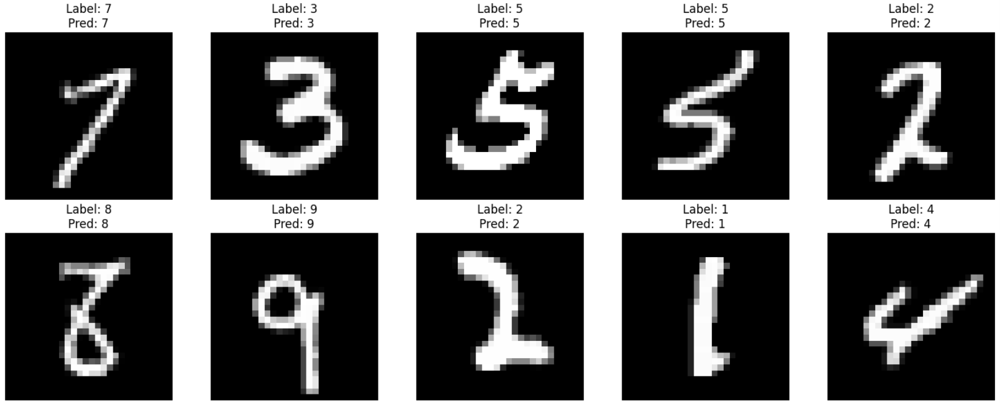
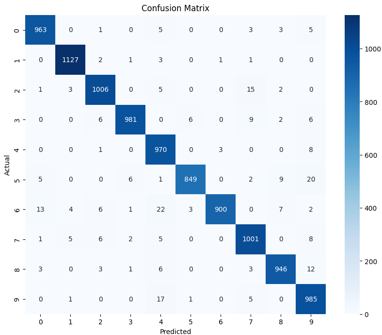

# Vision Transformer for MNIST

This repository contains an implementation of a Vision Transformer (ViT) for the MNIST dataset. The project demonstrates the ability to classify handwritten digits using a Transformer-based architecture.

## Features
- **Dataset**: Utilizes the MNIST dataset with 70,000 grayscale images of handwritten digits (60,000 for training and 10,000 for testing).
- **Model Architecture**: Implements a Vision Transformer with customizable parameters such as image size, patch size, number of classes, and more.
- **Training**: Includes training scripts with detailed loss tracking and evaluation metrics.
- **Visualization**: Provides visualizations of correct and incorrect predictions, as well as a confusion matrix for performance analysis.

## Setup and Usage

### Clone the Repository
```bash
git clone https://github.com/yourusername/ViT_MNIST.git
cd ViT_MNIST
```

### Launch Jupyter Notebook

```bash
jupyter notebook Vision_Transformer_for_MNIST.ipynb
```

### Run All Cells
Execute all cells in the notebook to preprocess data, define models, and start the training process.

## Example Plots
### Correct and Incorrect Predictions:

<p align="center">
  
</p>

### Confusion Matrix:

<p align="center">
  
</p>
